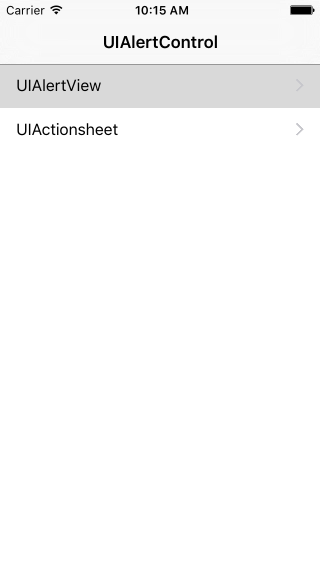
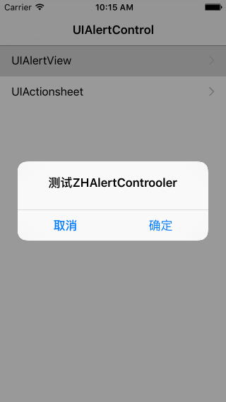
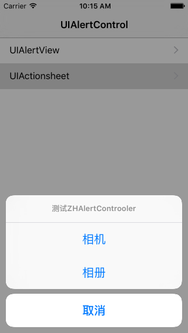

# ZHAlertController
封装系统的UIAlertControll UIAlertView UIActionsheet







## 安装

cocoapods

```ruby
pod ZHAlertController2
```

## 使用

```objc
ZHAlertControllerStyle style = ZHAlertControllerStyleAlertView;
    if (indexPath.row == 1) {
        style = ZHAlertControllerStyleActionSheet;
    }
    ZHAlertController *controller = [[ZHAlertController alloc] initWithStyle:style title:@"这是标题" message:@"这是描述" cannelButton:@"取消" otherButtons:@[@"其他按钮"]];
    controller.delegate = self;
    [controller showInController:self];
```

## 代理

```objc
#pragma mark - ZHAlertControllerDelegate
- (void)alertControllerDidClickCancelButton:(ZHAlertController *)alertController {
    NSLog(@"你点击了取消按钮");
}

- (void)alertController:(ZHAlertController *)alertController didClickOtherButtonAtIndex:(NSInteger)otherButtonIndex {
    NSLog(@"你点击了其他按钮");
}
```

